# `Snap!` #
`Snap!` is a fun filled, memory game. Players select two cards, if they match, it's a `Snap!` If not, the cards turn back around and you try again. They keep going until they have all 6 pairs. It's a good game for passing time, for having a bit of silliness and enjoying a user interface that is easy on the eyes and easy to use. 

Get comfortable, be silly and <a href = https://pjrclarke.github.io/snap/index.html>click here to play `Snap!`</a>.

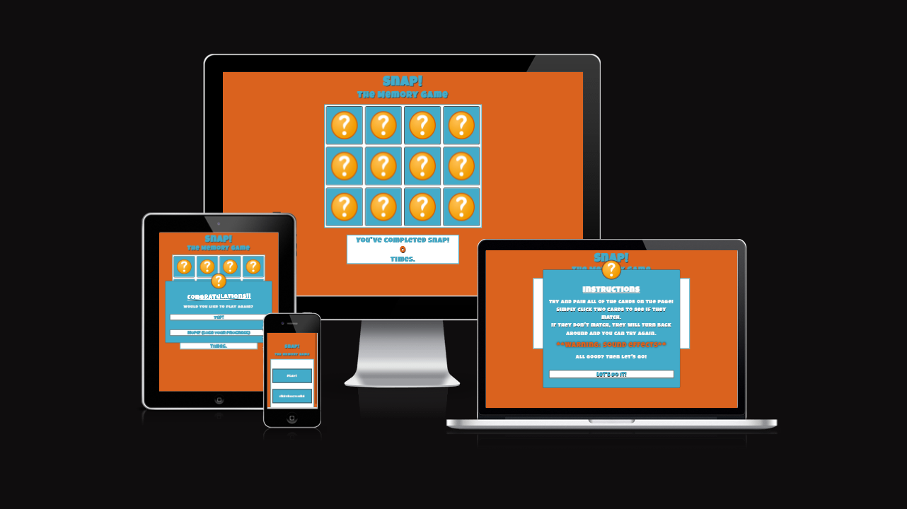

# Contents
* [**User Experience**](<#user-experience>)
    * [User Stories](<#user-stories>)
* [**Wireframes**](<#wireframes>)
* [**Site Structure**](#site-structure)
* [**Design Choices**](#design-choices)
    * [Typography](#typography)
    * [Colour Choices](#colour-choices)
* [**Features**](<#features>)
    * [Home Page](<#home-page>)
    * [Game](<#game>)
    * [Future Features](<#future-features>)
    * [Technologies Used](#technologies-used)
* [**Testing**](<#testing>)
    * [Lighthouse - Home Page](<#lighthouse---index.html>)
    * [Lighthouse - Game Page](<#lighthouse---game.html>)
* [**Validator Testing**](<#validator-testing>)
    * [HTML - Validation](<#html---validation>)
    * [CSS - Validation](<#css---validation>)
* [**Known Bugs**](<#known-bugs>)
    * [Resolved](<#resolved>)
    * [Unresolved](<#unresolved>)
    * [Accessibility](<#accessibility>)
* [**Testing User Stories**](<#testing-user-stories>)
* [**Deployment**](<#deployment>)
    * [To deploy the project](<#to-deploy-the-project>)
    * [To fork the project](<#to-fork-the-project>)
    * [To clone the project](<#to-clone-the-project>)
* [**Credits**](<#credits>)
    * [Content](<#content>)
    * [Media](<#media>)
    * [Acknowledgments](<#acknowledgments>)


# User Experience #

## User Stories ##

- As a user, I want to play a game that works. 
- As a user, I want the game `Snap!` to feel familiar.
- As a user, the game needs to be fun, enjoyable and memorable. 
- As a user, I want to be able to navigate the site with ease.
- As a user, I want to track how many times I win.

# Wireframes #

The Wireframes for `Snap!` were made on [Balsamiq](https://www.balsamiq.cloud).
The below wireframes are a good representation of change for the better. I had an initial idea to go down a portrait / landscape root. Maybe something for the future but from the wireframing, the finalised design isn't too far from the initial drawings. 

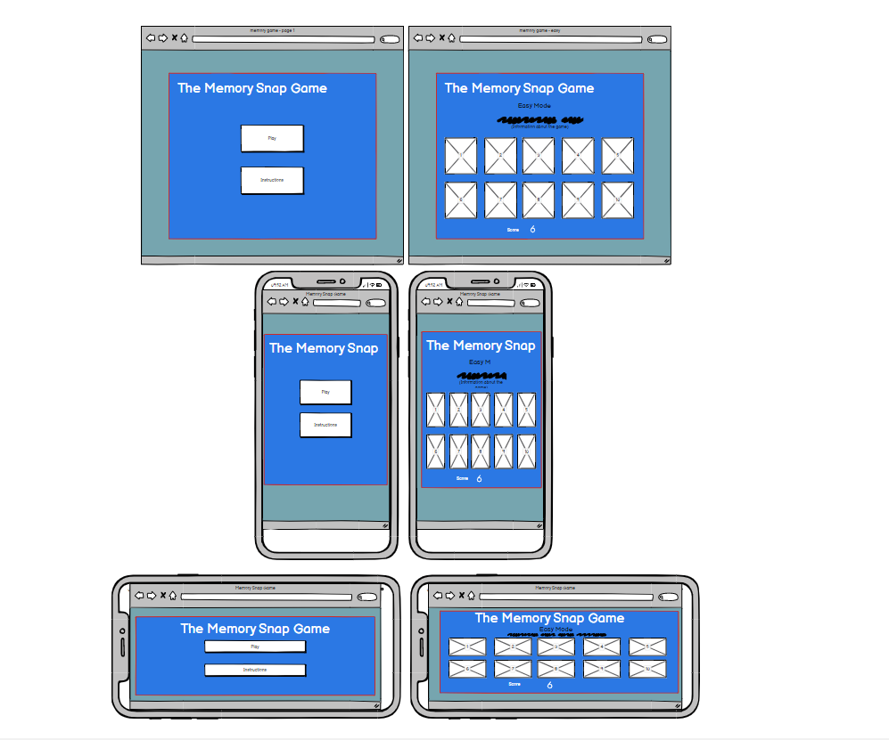

You can also see the quantity of cards has changed and there is a lot more consistency within the game itself due to this.

[Back to top](<#contents>)
<hr>

# Site Structure #

`Snap!` has two simple pages. [Home](index.html), which gives an option to play and to read instructions and [Game](game.html) to play the game.

# Design Choices #

## Typography ##

When thinking about `Snap!` and how much I wanted it to be a fun experience for the user. The font needs to be something fun, rounded and partly nonsensical. The font [Luckiest Guy](https://fonts.google.com/specimen/Luckiest+Guy?query=luckiest+guy) in regular 400 was a perfect choice and one I found straight away at the start of the project. The mix of uppercase and lowercase letters and the slightly off line effect made this a sure choice for this game. 

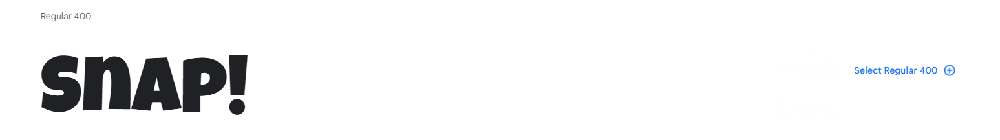


[Back to top](<#contents>)
<hr>

## Colour Choices ##

The inspiration behind the colour choices for `Snap!`, came from the japanese animation 'Dragon Ball'. The orange and blue combination gave off a really fun and colourful design and mixed well on the screen. The orange is called 'Darker Coral' whereas the blue is called 'Lighter Alice'. I have text shadowing and border lines using 'Black Olive'.

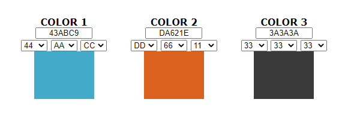

[Back to top](<#contents>)
<hr>

# Features #

## Home Page ##

To start we have the [Favicon](https://favicon.io/favicon-generator/) which replicates the font and colouring of the website and upholds that consistency across the site. 


You're welcomed by a bright and fun page. Showing the buttons Play and Instructions gives the user clear indication what to do next. 

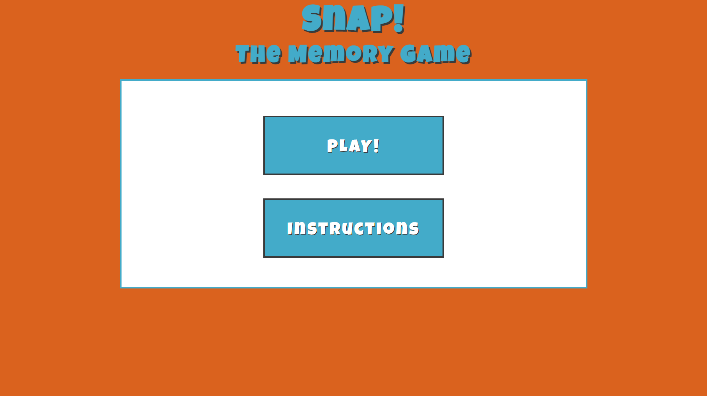

Selecting play will take you straight to the [Game](game.html) action whereas clicking 'Instructions' will open a pop-up giving directions on how the game works and includes a small warning about the sound effects. 

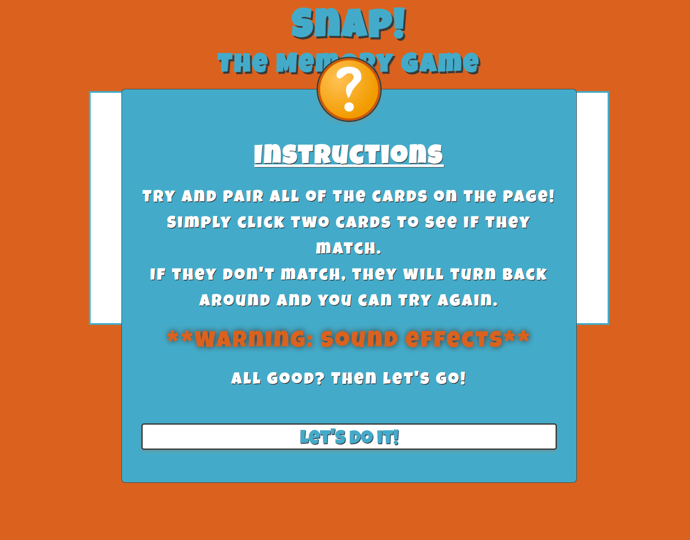

[Back to top](<#contents>)
<hr>

## Game ## 

The Game page welcomes the user with fun filled mystery. 12 squares (cards) are offered out with the score shown at the bottom. The colours are mirrored by the colours already chosen to remain consistent with the site dynamic. 

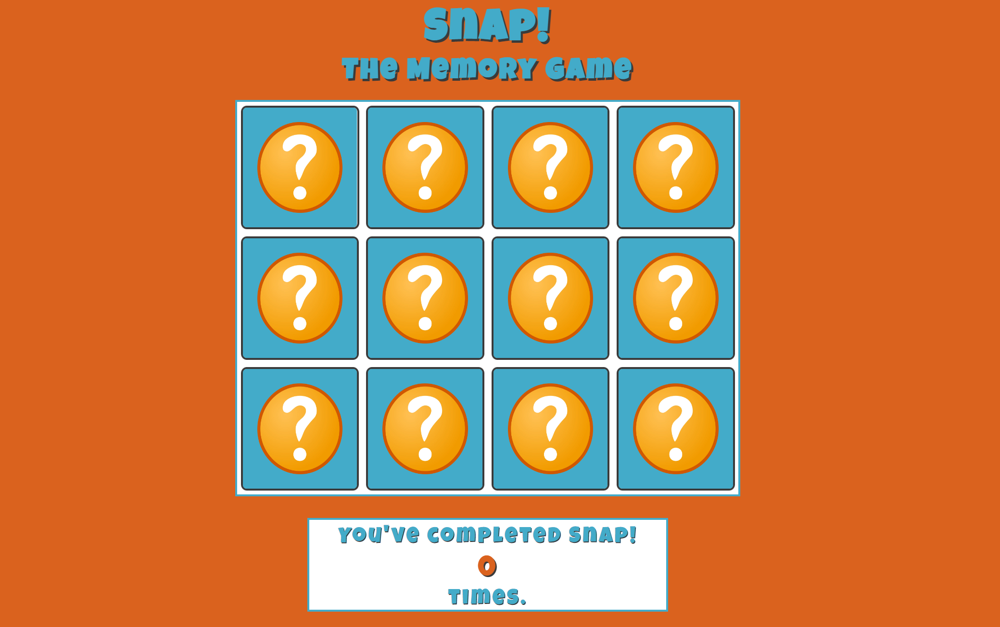

When selecting these cards, the user is offered a few things to immerse them. Firstly, we have a smooth flipping of the cards, colourful and fun numbers on different coloured backgrounds and fun little sound effects (my four year old son laughed so confirmation that it works) which are different depending on whether you select the right match or wrong match. 

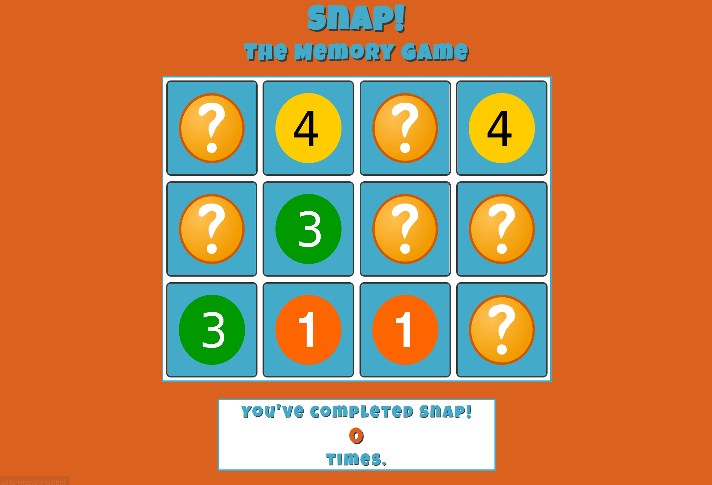

When the game is over a pop-up shows up congratulating you for completing the board. The word 'Congratulations' shakes more than my washing machine trying  to escape its cupboard, a sound effect of a tremendous fanfare, an option to play again or leave and lose the progress of the score which will increase the more you play the game. 

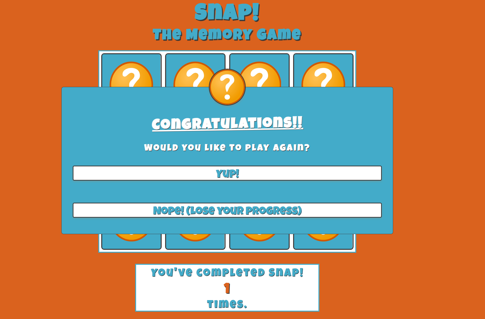

[Back to top](<#contents>)
<hr>

## Future Features ## 

- Creating a timer to check how fast a user takes to complete the board.
- Incorporating a leaderboard so the user can see where they stack with the world. 
- A higher difficulty with more cards and harder to spot differences. 
- A game of chance and ultimate difficulty. When you get a match wrong, the board shuffles again.
- custom artwork to keep consistency with image ratio. 
- Create a version of the site and game dedicated for the visually impaired to help guide them. Including;
    * Colour contrasting
    * Shaking and zoom functions when highlighting a card. 

[Back to top](<#contents>)
<hr>

# Technologies used #

* [HTML5](https://en.wikipedia.org/wiki/HTML5) - Provides the content for the website.
* [CSS](https://www.w3schools.com/css/css_intro.asp) - Provides the styling.
* [JavaScript](https://developer.mozilla.org/en-US/docs/Web/JavaScript) - Provides the scripting for the website. 
* [Balsamiq](https://balsamiq.cloud/) - Used to create the wireframes. 
* [CodeAnywhere](https://codeanywhere.com/) - Used to host and edit all code and the website. 
* [Gitpod](https://www.gitpod.io/#get-started) - Used to deploy the website

[Back to top](<#contents>)
<hr>

# Testing #

## HTML Lighthouse Testing ##

## Lighthouse - index.html ##

Home Page Lighthouse report:


## Lighthouse - game.html ###

The game page Lighthouse report found the following:


Best Practices came up at 83% based off of image ratio - Admittedly, I knew this was going to be an issue for this game however, as mentioned in future features. I want to have custom imagery and have better control on the card ratio. 

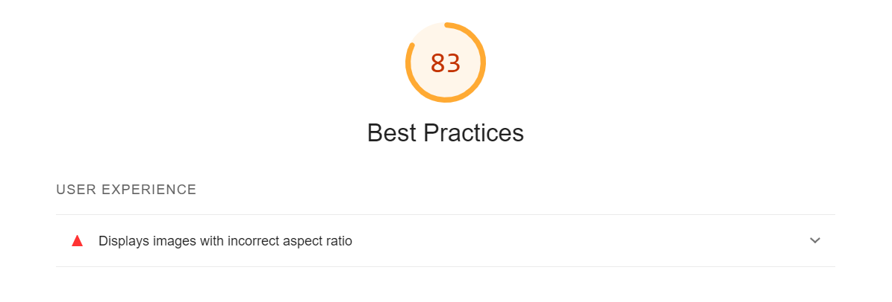

[Back to top](<#contents>)
<hr>

# Validator Testing #

## HTML Validation ##

No errors or issues were returned when passing through the official [W3C validator](https://validator.w3.org/nu/?doc=https%3A%2F%2Fcode-institute-org.github.io%2Flove-running-2.0%2Findex.html)

Validation for **index.html** found the following results:

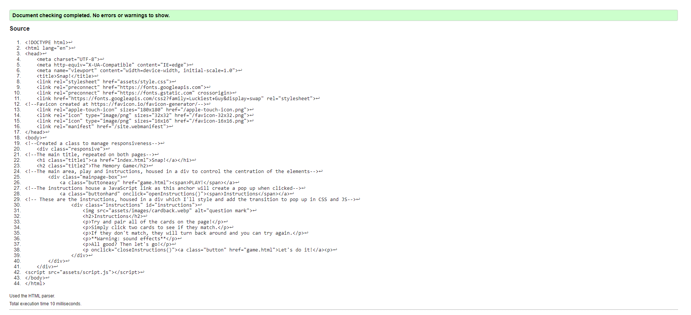

Validation for **game.html** found the following results:

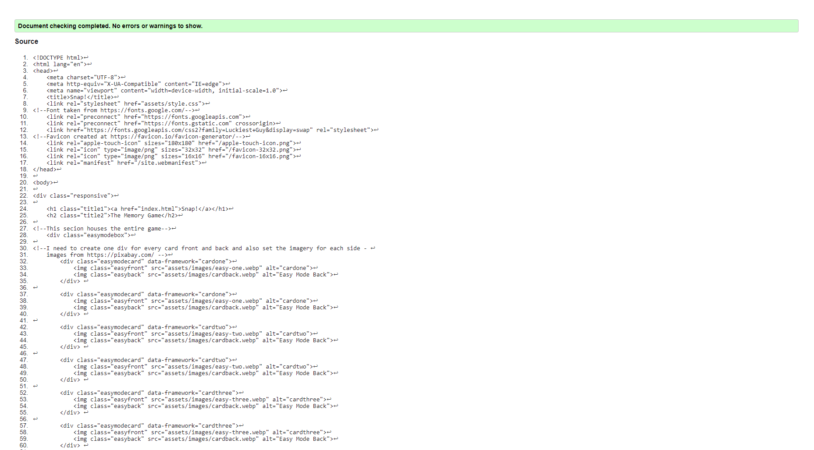

## CSS Validation ##

No errors or issues were found when passing through the official [(Jigsaw) validator](https://jigsaw.w3.org/css-validator/validator?uri=https%3A%2F%2Fvalidator.w3.org%2Fnu%2F%3Fdoc%3Dhttps%253A%252F%252Fcode-institute-org.github.io%252Flove-running-2.0%252Findex.html&profile=css3svg&usermedium=all&warning=1&vextwarning=&lang=en#css)

Validation for **style.css** found the following results:

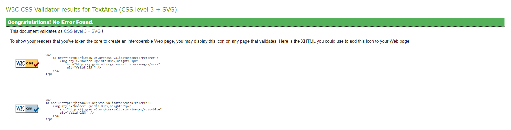

## JavaScript ##
The JavaScript code was checked over by [jshint](https://jshint.com/) which found the following results;
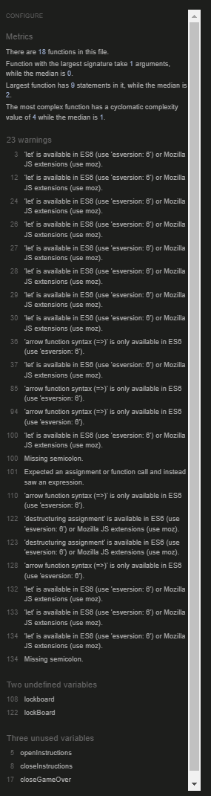

[Back to top](<#contents>)
<hr>

# Known Bugs #

## Resolved ##

### Bugs in the code ##

- The opening page - Couldn't figure out how to center on a vertical axis. I found that display:flex and its properties were the best solution here. 

- The cards on easymode.html were shifting to the right slightly, realised as I had text-align: center; in the body, this was the issue. Removed and this fixed the issue. 

- When gameOver() was called. All of the functions were working. Apart from the cards were not flipping back over. 

```
function gameOver () {
        alert("Congrats!");
        resetBoard();
        shuffle();
        unflipCards();
        score += 1;
        document.getElementById("total").innerHTML = score; 
        cards.forEach(card => card.classList.remove('flip'))
        console.log("game over was called")
}
```

Solved by creating a new function called newGame() and added the relevant functions into it to allow the flipping to work.  

- Within my initial code, there was no code to say when the cards matched up it was game over. 

```
function checkWin () {
    if(matchedCards === 6){
    gameOver();}
}

function gameOver () {
    if (checkWin === true) {
        alert("Congrats!");
        resetBoard();
        shuffle();
        score += 1;
        document.getElementsByClassName("total").innerHTML = score; 
    }
}
console.log(gameOver);
```
This was resolved with the above coding. Creating a function to check the matched cards and if it reached 6 pairs, then to begin the gameOver() function. 

- The shuffle function wasn't working until I realised that I had far too many brackets in here and didn't call the function in the right area. 

```
(function shuffle() {
    cards.forEach(card => {
        let ramdomPos = Math.floor(Math.random() * 12);
        card.style.order = ramdomPos;
    });
})();
```
I resolved this by removing the unnecessary brackets and putting the function in the necessary areas. 

## Unresolved ## 

### Image ratio ### 

As mentioned before the image ratio isn't set and to make this as consistent as possible, the images all should be the same ratio. Future features should include custom imagery to ensure consistency across the board. 

### Accessibility ###

- I found that during my testing that the accessibility was slightly lower to what I'd like it to be. This is due to the colour contrasts. I found that the only real way of contrasting the colours I had chosen for this game was to put white or black with the colour choices and then darken the tone of them. 
- The results for it are below.

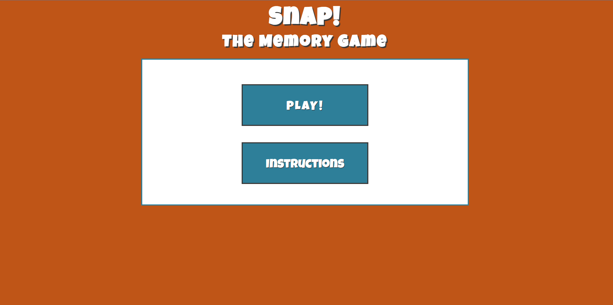

The Lighthouse results for this are as follows;


I found that after viewing it, the colours being this bland and dull took away from the fun dynamic of the game. I decided to keep it the same and add it in as a future feature. I'd create a seperate game and connect a link for the contrasting version of the game to aid those who are visually impaired.

[Back to top](<#contents>)
<hr>

## Testing User Stories ## 

- As a user, I want to play a game that works. 
    * The game works from start to end.
- As a user, I want the game `Snap!` to feel familiar.
    * Snap is a very recognisable game and this variation of the game lends itself to that nostalgic feel.
- As a user, the game needs to be fun, enjoyable and memorable. 
    * Silly noises, the nostalgic feel and the bright colours give this variation of the snap game a come back for another turn feeling. 
- As a user, I want to be able to navigate the site with ease.
    * The site functions are made to be as easy as possible with few buttons to overcomplicate. 
- As a user, I want to track how many times I win.
    * Integrated a score keeper below the game so the user can easily see how many times they've beat the board. 

[Back to top](<#contents>)
<hr>

# Deployment

## To deploy the project ##

The site was deployed to GitHub pages. The steps to deploy are as follows:

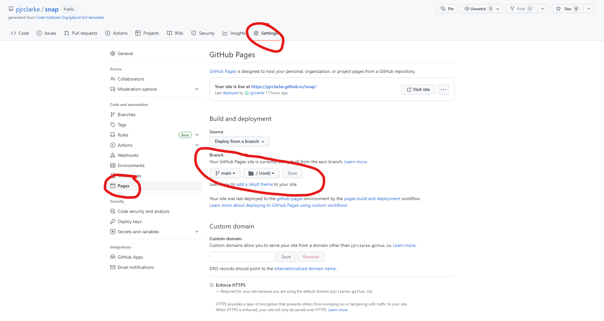

- In the GitHub repository, navigate to the Settings tab.
- Select pages on the left hand menu.
- Ensured "deploy from a branch" is selected.
- Ensure the branch is set to "main" and "/root".
- Click save.
- Allow a minute.
- Refresh and the deployed link can be found at the top of the page.

The link can be found here - [Github - Paul Clarke - `Snap!`](https://pjrclarke.github.io/snap/index.html)

## To fork the project ## 

A copy of the repository can be made by forking the github account. This is the safest way to view and make changes as it won't have any affect on the original repository. The steps to fork the repository as as follows;

- Log into Github and find the [repository](https://github.com/pjrclarke/snap/).
- On the right hand side of the screen, there is a button called 'Fork'. Select this to  for the repository onto this github account. 
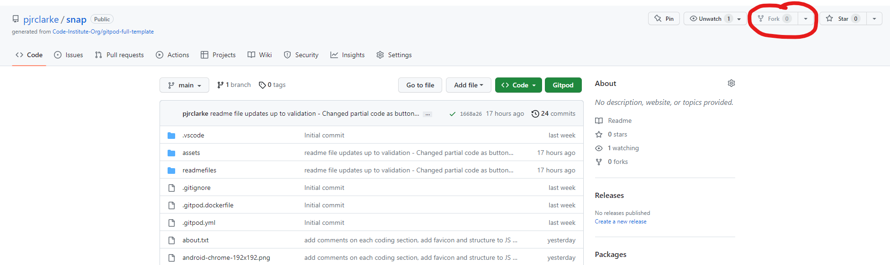

## To clone the project ##

The method to clone this repository is as follows; 

- Under the repository name, click on the clone tab. 
- Once selected, click the copy to clipboard icon. 

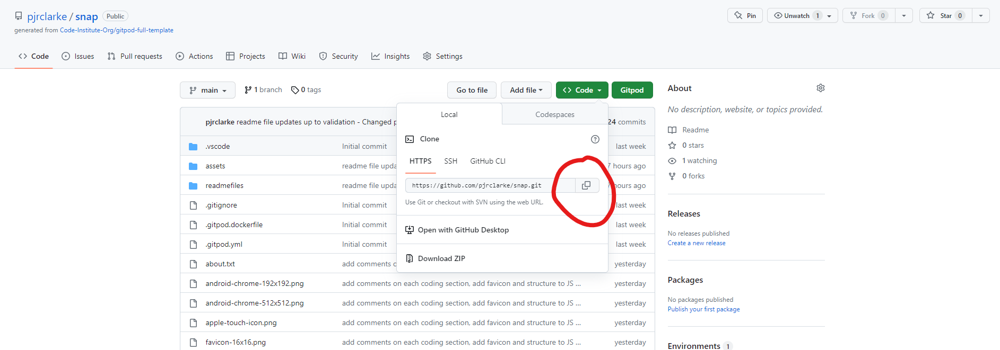

- In the IDE chosen to clone the project to, open gitbash.
- Change the working directory to the location you want the cloned directory to be made. 
- Type "git clone" in the terminal and then paste the URL copied from github.
- Press Enter - The clone is now created. 

[Back to top](<#contents>)
<hr>

## Content ##
- The fonts were taken from [Google Fonts](https://fonts.google.com/)
- HTML and CSS code is custom.
- Javascript code was inspired by Marina Ferreira - https://marina-ferreira.github.io/tutorials/js/memory-game/. I built upon her code and as it felt unfinished, I finished it. 
- The Wireframes were created using software on [Balsamiq](https://www.balsamiq.cloud).

## Media ##

- Images were taken from https://pixabay.com/ which offers Stunning royalty-free images & royalty-free stock images. 
- Sounds were downloaded from https://freesound.org where you can Find any sound you like in a collaborative collection of 599,791 free sounds.
- The favicon was created on https://favicon.io/favicon-generator/ 


[Back to top](<#contents>)
<hr>

## Acknowledgments ##

The site was completed as a Portfolio Project 2 piece for the Full Stack Software Developer (e-Commerce) Diploma at the [Code Institute](https://codeinstitute.net/). As such I would like to thank my mentor [Precious Ijege](https://www.linkedin.com/in/precious-ijege-908a00168/), the Slack community, and all at the Code Institute for their help and support.

Thank you to [Easy Tutorials](https://www.youtube.com/@EasyTutorialsVideo) who uploaded this video https://www.youtube.com/watch?v=AF6vGYIyV8M. This helped me understand how to incorporate a popup in my code.

I'd also like to make a special mention to the Tutor, Sarah, at the Code Institute for aiding me along with my code and helping me understand how parts work.  

Paul Clarke - 2023. 

[Back to top](<#contents>)
<hr>